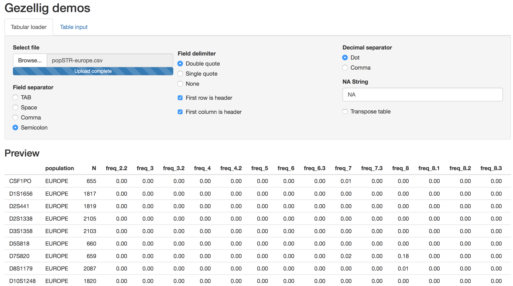
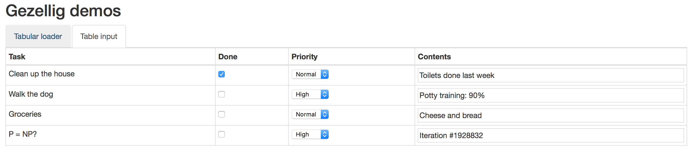

```{r setup, include=FALSE}
knitr::opts_chunk$set(echo = TRUE)
```

# Gezellig - A UI toolkit that complements R Shiny

## Installation

`gezellig` is only available on GitHub so the `devtools` package is required to install it. If you do not have it installed (or you are not sure if you have it) install it from CRAN with the following command:

```{r eval=FALSE}
install.packages("devtools")
```

Once you have `devtools`, the `gezellig` package can be installed with
```{r eval=FALSE}
devtools::install_github("knifecake/gezellig")
```

## Demo


The package includes a small Shiny application demonstrating all the custom input objects available. An instance of this application has been pushed to shinyapps.io under the free plan. That means that if I haven't run out of computation time you can find it at [https://knifecake.shinyapps.io/gezellig_demos/](https://knifecake.shinyapps.io/gezellig_demos/). Alternatively, you can run it locally. After installing the package, you may launch it with

```{r eval=FALSE}
library("gezellig")
start_demo()
```


## UI Modules

### Tabular data loader

The tabular data loader is a set of inputs that facilitates loading tabular data. The justification of this module is that tabular data formats are not so standard: field separators may be tabs or commas, field delimiters may be double or single quotes, decimal separators may be commas or dots, etc. Furthermore, all these options can be combined giving rise to dozens of micro formats. This module allows the user to adjust these parameters. More precisely, it provides a graphical wrapper around some of the parameters of the R function `read.table`. It is intended to be used interactively: the user should play around with the options until the data looks right (for this, accompanying the module with a table preview is useful).



A simple deployment of the module may look like this:

```{r eval=FALSE}
library(shiny)
library(gezellig)

ui <- fluidPage(
  tabular_data_loader_input("tabular"),
  tableOutput("tabular_output")
)


server <- function(input, output, session) {
  df <- callModule(tabular_data_loader, "tabular")

  output$tabular_output <- renderTable(df(), rownames = TRUE)
}

shinyApp(ui = ui, server = server)
```

Functionality can be further customised, for instance by hiding some input controls. For more details consult the documentation by typing `?tabular_data_loader_input` into an interactive R session.

### Table inputs

Table inputs is a custom input object that allows tables to contain other input objects such as checkboxes, radio buttons and dropdowns. It is intended for those cases where the same inputs are required for a bunch of items and hence it makes sense to organise them in a table.



A simple deployment of the module might look like this.

```{r eval=FALSE}
library(shiny)
library(gezellig)

ui <- fluidPage(
  ti_input("table_input")
)


server <- function(input, output, session) {
  # Table input
  tb <- callModule(ti, "table_input",
                   fields = ti_fields,
                   data = ti_data)

  observe({
    print(tb())
  })
}

ti_fields <- list(ti_label("Name"),
                  ti_checkbox("Done"),
                  ti_dropdown("Priority", c("normal" = "Normal",
                                            "high" = "High")))

ti_data <- data.frame(Name = c("Task 1", "Task 2"),
                      Done = c(TRUE, FALSE),
                      Priority = c("normal", "high"))

shinyApp(ui = ui, server = server)
```

